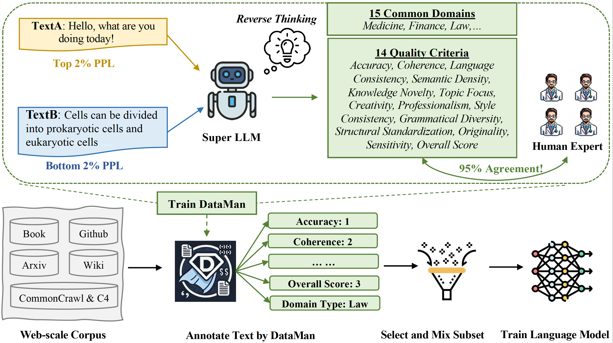

# DataMan: Data Manager for Pre-training Large Language Models

This is the official repository for our ICLR'25 paper [DataMan: Data Manager for Pre-training Large Language Models](https://openreview.net/forum?id=eNbA8Fqir4).
It provides code to: 
1. Collect fine-tuning data—document quality ratings and domain types—via a SuperLLM;
2. Train and evaluate DataMan models;
3. Annotate text quality and domain by DataMan;
4. Select and mix data by DataMan Annotation;
5. Train language models;
6. Evaluate language models;
7. Reproduce the paper’s analyses.

**Note**: This repository is solely developed and maintained by me. If you find it helpful, feel free to follow and give a ⭐ to support my hard work. Due to limited bandwidth, I may not be able to respond to every issue quickly.


<p align="center">
  <br>
  Pipeline of the <em>Sample-with-DataMan</em> framework. 
</p>

## Datasets
The fine-tuning data are subject to license and confidentiality agreements; releasing them would vithereforeolate company policy. 
Consequently, we share only the preprocessing/analysis code and the public pre-training dataset [SlimPajama](https://huggingface.co/datasets/cerebras/SlimPajama-627B).
The paper’s DataPajama set contains 447B tokens and is too large to release for now, users can reconstruct it with the supplied code and DataMan models.

## Models

### DataMan Models 
🔥 Four variants (Dense/MoE × EN/ZH) are now on the HuggingFace Hub. 🔥
- Dense: fine-tuned from [Qwen2-1.5B](https://huggingface.co/Qwen/Qwen2-1.5B)  
- MoE:   fine-tuned from [Qwen1.5-MoE-A2.7B](https://huggingface.co/Qwen/Qwen1.5-MoE-A2.7B)
- English/Chinese: The two versions differ only in the language of the fine-tuning corpus. 

| Variant | Link |
|---------|------|
| English Dense | [RuPeng/DataMan-1.5B-EN](https://huggingface.co/RuPeng/DataMan-1.5B-EN) |
| Chinese Dense | [RuPeng/DataMan-1.5B-ZH](https://huggingface.co/RuPeng/DataMan-1.5B-ZH) |
| English MoE   | [RuPeng/DataMan-MoE-A2.7B-EN](https://huggingface.co/RuPeng/DataMan-MoE-A2.7B-EN) |
| Chinese MoE   | [RuPeng/DataMan-MoE-A2.7B-ZH](https://huggingface.co/RuPeng/DataMan-MoE-A2.7B-ZH) |

### Language Models
Using different data selection methods, we select a 30B token subset from either 447B-token DataPajama or 296B-token DataChineseWebText and train a randomly initialized either Sheared-Llama-1.3B or Qwen2.5-1.5B language model for one epoch in a randomly shuffled order.

Most baseline models referenced in the paper can be downloaded from [princeton-nlp/QuRating](https://github.com/princeton-nlp/QuRating?tab=readme-ov-file#models).
Our trained models have not yet passed the company’s open-source disclosure process (*in-progress*).

## Experiments (English task shown; the process is identical for Chinese)
### 1. Installing the Repo and Environment
Clone this repo and create a new environment based on `python 3.11.7`. Install the requirements in the following order:
```bash
pip install torch==2.1.2 torchvision==0.16.2 torchaudio==2.1.2
pip install -r requirements.txt
```
My Conda environment configuration is available in `config.yml` for reference.

### 2. Collecting fine-tuning Data 
The Python file `sft/prepare_data.py`, together with the shell scripts listed below, produces quality ratings and domain types for each fine-tuning document using GPT-4. All scripts operate on JSON-formatted documents, and the prompt templates provides in `sft/prepare_data.py` are identical to those used in the paper.

(1) Build requests: Generate input files required by GPT.
```bash
bash scripts/sft/en/prepare_data/prepare_gpt_request_4k.sh
bash scripts/sft/en/prepare_data/prepare_gpt_request_4k_suppl.sh
```

(2) Obtain responses: Query the OpenAI API with the generated requests (the calling script is withheld pending compliance review).

(3) Post-process responses: Parse GPT outputs and normalize the format.
```bash
bash scripts/sft/en/prepare_data/process_gpt_response_4k.sh
bash scripts/sft/en/prepare_data/process_gpt_response_4k_suppl.sh
```

(4) Create DataMan fine-tuning datasets: 

All-rating: 14 quality ratings + a domain type
```bash
bash scripts/sft/en/prepare_data/all_rating/prepare_qwen_request_suppl_4k_bal_q.sh
```

Score-Only: 14 quality ratings
```bash
bash scripts/sft/en/prepare_data/score_only/prepare_qwen_request_score_4k_bal_q.sh
```

Domain-Only: a domain type
```bash
bash scripts/sft/en/prepare_data/domain_only/prepare_qwen_request_detText_domain_4k_bal_q.sh
```

### 3. Training & evaluating DataMan models

The main python file is in `sft/finetune_qwen2.py` and `sft/modeling_qwen2.py`. The shell scripts below launch training and evaluation for various configurations; hyper-parameters can be edited directly in each script.

(1) All-rating (Dense) variant:
```bash
bash scripts/sft/en/all_rating/suppl_models/finetune_qwen2_1_5B_4k_suppl_bal_q4.sh
bash scripts/sft/en/all_rating/suppl_models/evaluate_qwen2_1_5B_4k_suppl_bal_q4.sh
```

(2) Score-Only (Dense) variant:
```bash
bash scripts/sft/en/score_only/modelscale_models/finetune_qwen2_score_1_5B_4k_bal_q4.sh
bash scripts/sft/en/score_only/modelscale_models/evaluate_qwen2_score_1_5B_4k_bal_q4.sh
```

(3) Domain-Only (Dense) variant:
```bash
bash scripts/sft/en/domain_only/modelscale_models/finetune_qwen2_detText_domain_1_5B_4k_bal_q4.sh
bash scripts/sft/en/domain_only/modelscale_models/evaluate_qwen2_detText_domain_1_5B_4k_bal_q4.sh
```

(4) All-rating (MoE) variant:
```bash
bash scripts/sft/en/all_rating/moe_models/finetune_qwen1_5_moe_2_7B_4k_bal_q4_multinodes.sh
bash scripts/sft/en/all_rating/moe_models/evaluate_qwen1_5_moe_2_7B_4k_bal_q4.sh
```

### 4. Annotating quality & domain with DataMan

Taking SlimPajama as an example, we demonstrate the full workflow of annotating document quality and domain with DataMan. If your data are already pre-processed, skip directly to Step (3).

(1) Acquire the Slimpajama dataset

  First, we can download the dataset using one of the three methods in `utils/hf_download.py`. Then, we decompress the .zst archives with `scripts/data_tools/en/get_slimpajama_org/unzip_slimpajama_zst.sh`. Next, we merge chunk files for each split via `scripts/data_tools/en/get_slimpajama_org/cat_{train,validation,test}_chunk.sh`. Finally, we werify file integrity by `scripts/data_tools/en/get_slimpajama_org/check_chunk.sh`.

(2) Tokenize the SlimPajama dataset

a. `data_tools/tokenize_dataset_concatenation.py`: tokenize + truncate long sentences + drop short ones
```bash
bash scripts/data_tools/en/tokenize_dataset/tokenize_dataset_dsw.sh
```

b. `data_tools/tokenize_dataset.py`: tokenize + truncate long sentences + concatenate short ones
```bash
bash scripts/data_tools/en/tokenize_dataset/tokenize_dataset_concat.sh
```

To further split the tokenized data into more shards, you can use `data_tools/split_hf_shard.py`:
```bash
bash scripts/data_tools/en/tokenize_dataset/split_hf_shard_dsw.sh
```

(3) Annotating the SlimPajama dataset with DataMan (⭐ **Core Usage** ⭐)

a. For JSON files: `data_tools/dataman_annotate.py`
```bash
bash scripts/data_tools/en/dataman_annotate/Slimpajama-627B/dense/dataman_annotate_all_rating_dsw.sh
```

b. For HuggingFace files: `data_tools/dataman_annotate_hf.py`
```bash
bash scripts/data_tools/en/dataman_annotate/Slimpajama-627B/dense/dataman_annotate_hf_all_rating_dsw.sh
```

### 5. Selecting & mixing data via annotations (⭐ **Core Usage** ⭐)

Continuing with SlimPajama, we demonstrate how to employ the core python file `/DataMan/data_tools/select_subset.py` to select and mixup the dataset based on the annotated quality and domain labels. 
Ready-made sampling recipes are provided for various scenarios:

a. Individual quality metrics (14 in total): `scripts/data_tools/en/select_subset/dense/individual_quality_criteria`

b. Composite metrics (Overall_score and quality_criteria_mix): `scripts/data_tools/en/select_subset/dense/overall_score`, `scripts/data_tools/en/select_subset/dense/quality_criteria_mix`

c. Uniform sampling: `scripts/data_tools/en/select_subset/dense/uniform`

d. Domain-specific sampling: `scripts/data_tools/en/select_subset/dense/specific_domain`

e. 60B-token subset: `scripts/data_tools/en/select_subset/dense/60B`


### 6. Training language models
All pre-training python files are located in `DataMan/pretrain` and all shell scripts are organised as follows:

a. base model: Sheared-LLaMA-1.3B (English), 30 B tokens: `scripts/pretrain/en/dense/30B`

b. base model: Sheared-LLaMA-1.3B (English), 60 B tokens: `scripts/pretrain/en/dense/60B`

c. base model: Sheared-LLaMA-1.3B (English), domain-specific pre-training (finance, law, medicine): `scripts/pretrain/en/dense/cpt`

d. base model: Qwen 2.5-1.5B (Chinese), 30 B tokens: `scripts/pretrain/zh/moe/30B`


### 7. Evaluating language models
We evaluate the trained models on three aspects: in-context learning (ICL), perplexity (PPL), and instruction-following win rate (requires an OpenAI API key).
Source code for these evaluations resides in `DataMan/eval`, ICL: `eval/lm-evaluation-harness`, PPL: `eval/loglikelihood.py`, instruction following: `eval/instruction_tuning`.

Evaluation shell scripts:
i)-English tasks: `DataMan/scripts/eval/en/dense/30B` (single-GPU and multi-GPU versions available);
ii)-Chinese tasks: `DataMan/scripts/eval/zh/moe/30B`.

### 8. Analyses

(1) Data inspection: examine examples of original documents from each source under Dataman’s quality criteria and ratings. Shell Script: `analysis/en/data_inspection.py`, Python Code: `scripts/analysis/en/data_inspection.sh`

(2) DataMan pointwise rating vs. Qurating pairwise rating. Shell Script: `analysis/sorted_field.py`. Annotation Output: `analysis/DataMan_Pointwise_vs_Qurating_Pairwise_Ranking`.

(3) Complementarity nature of quality criteria: compute Pearson correlation heatmap between 14 quality criteria in the fine-tuning dataset. Python Code: `analysis/overallscore_vs_other_criteria.py`

(4) PPL anomalies: locate and explain documents with perplexity outliers. Python Code: `analysis/ppl_anomalies.py`

(5) Distribution of quality ratings: plot the distribution of quality ratings across different sources in DataPajama. Python Code: analysis/quality_rating_dist_dense.py

(6) Dataset statistics for EN / ZH pre-training, fine-tuning dataset: the number and proportion of documents categorized by domain, Overall Score, and source
• EN pre-train: `analysis/statistic_sft_data.py`
• ZH pre-train: `analysis/statistic_chinesewebtext2_data.py`
• Fine-tune: `analysis/statistic_sft_data.py`


## Citation
If you use the code in your research, please cite:
```bibtex
@article{peng2025dataman,
  title={Dataman: Data manager for pre-training large language models},
  author={Peng, Ru and Yang, Kexin and Zeng, Yawen and Lin, Junyang and Liu, Dayiheng and Zhao, Junbo},
  journal={arXiv preprint arXiv:2502.19363},
  year={2025}
}
```